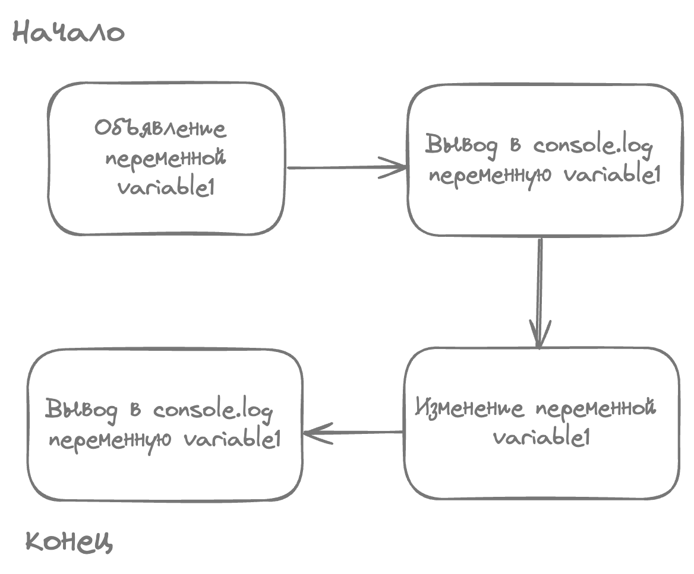
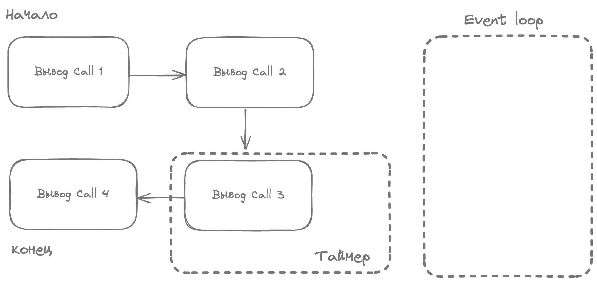
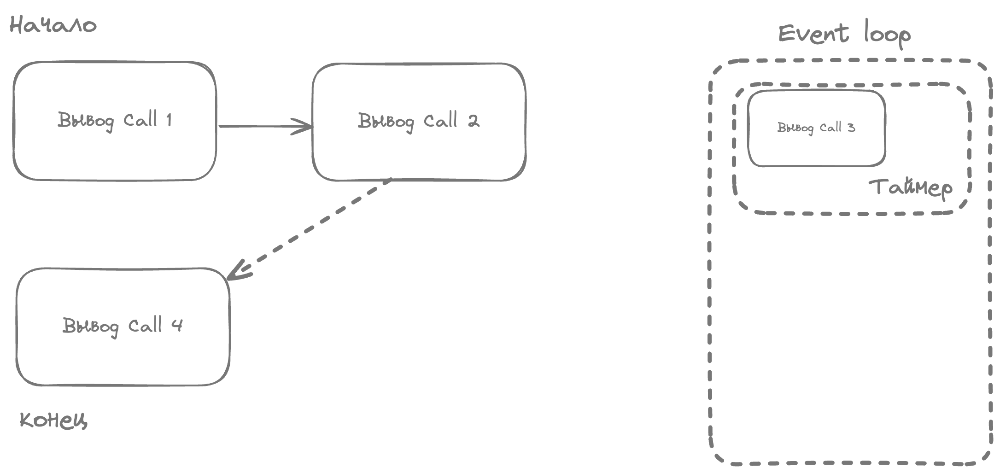

## 🔄 Разбор Event loop :

> Javascript был спроектирован как однопоточный язык программирования. Это значит, что он может выполнять только одну операцию одновременно. Тем не менее у JavaScript есть такой механизм как Event Loop, который как раз и позволяет выполнять "асинхронные" операции. Почему "асинхронные" в кавычках? Да просто потому что JavaScript тоже выполняет их синхронно, асинхронности в самом JavaScript как таковой нет. Вперед под кат, будем разбираться)

### Зачем он нужен?
Стоит понять для чего же изобрели event loop? Все просто, представьте, если бы Javascript был бы однопоточный и **синхронным**. 

К примеру у нас есть сайт, где при каждом клике вызывается анимация, которая длится 2 секунды. А также есть функционал изменения данных профиля, которые отправляется на бекенд.

Что тогда будет если пользователь захочет обновить данные профиля? При нажатии на кнопку "Обновить данные" сработает анимация, которая длится 2 секунды, и только потом пойдет запрос на обноление данных.
С точки зрения UX это очень плохой сайт. Эту проблему и решает Event loop :) 

Чуть ниже будет подробнее описан данный пример.

### 1. Синхронный код. Начнем с примеров.

Пример:

```js
let variable1 = 1
console.log(variable1)

variable1 = 2
console.log(variable1)
```

Рисунок 1: 



Как мы видим в примере 1. Наш код идет синхронно, выполенение шаг за шагом. 

### 2. А теперь пример с асинхронным кодом. 

Рассмотрим следующий пример:

```js
console.log('Call 1');

console.log('Call 2');

setTimeout(()=>{
    console.log('Call 3');
}, 0)

console.log("Call 4:");

// Output: Call 1 => Call 2 => Call 4 => Call 3
```
Тут как раз таки и работает наш Event Loop. Все синхронные операции будут выполняться как только интерпретатор дойдет до них.

Рисунок 2: 


Как только интерпретатор дойдет до setTimeout. Он как бы вынесет данную операцию из очереди. Она окажется в стеке event loop. **Дальше интерпретатор выполнит все синхронные задачи** (Call 1, Call 3, Call 4) и только потом возьмет задачу из event loop.

При этом заметьте что у setTimeout стоит время 0. Как бы говорит нам, что выполнение задачи произойдет сразу, но нет. 

Рисунок 3: 


### 3. Разберем что такое макро и микро таски.
Теперь чуть посложнее, если вы давно в теме, то наверное слышали об "макро" и "микро" тасках. Давайте разберемся что это.

Под копотом Event Loop делит асинхронные задачи на 3 категории: 

1. Макротаски (Macro task)
2. Микротаски (Micro task)
3. Задачи отрисовки (Render task)

<!--todo: Побольше описать что относится к макротаскам - queueMicrotask, Intersection Observer -->
К микротаскам относятся: Promise (.then/catch/finall), [также Intersection Observer API](https://developer.mozilla.org/en-US/docs/Web/API/Intersection_Observer_API), [queueMicrotask](https://developer.mozilla.org/en-US/docs/Web/API/Window)


К макротаскам относятся все остальное: setTimeout, XmlHTTPRequest и так далее.

В задачи отрисовки попадают задачи связанные с отрисовкой и обновлением контента страницы.

Стоит отметить, что у Event loop есть приоритет выполнения этих задач. **В первую очередь выполняются все микро таски, а только потом берется одна макротаска.** 

```js
console.log('Call 1');

console.log('Call 2');

setTimeout(()=>{
    console.log('Call 3');
}, 0)

new Promise((resolve)=>{
    console.log('Call 5');
    resolve()
}).then(() => {
  console.log('Call 6');
});

console.log("Call 7");

// Output: Call 1 => Call 2 => Call 5 => Call 7 => Call 6 => Call 3
```

> Напомню, что внутри конструктора Promise коллбэки будут являться синхронными

В примере видим, что сначала выполняются все синхронные операции 1 -> 2 -> 5 -> 7. Затем выполнятся микротаска .then (5), а после макротаска setTimeout (3).

Теперь задача посложнее, попробуйте сами решить какой порядок выведется.

```js
console.log('Call 1');

console.log('Call 2');

setTimeout(()=>{
    console.log('Call 3');
    new Promise(() => {
            resolve()
            console.log('Call 5')
        })
        .then(() => console.log('Call 6'))
}, 0)

setTimeout(()=>{
    console.log('Call 7');
}, 0)

new Promise((resolve)=>{
    console.log('Call 8');
    resolve()
})
    .then(() => console.log('Call 9'))
    .then(() => console.log('Call 10'))

console.log("Call 11");
```

<details>
    <summary>Ответ</summary>
    <blockquote>
    Call 1 -> Call 2 -> Call 8 -> Call 11 -> Call 9 -> Call 10 -> Call 3 -> Call 5 -> Call 6 -> Call 7
    </blockquote>
</details>

В данном примере видно, что если мы имеем 2 макротаски setTimeout и одна создает новую микротаску. Можно подумать, что по очередности должна быть вторая макротаска, но нет. Как мы помним сначала выполняются все микротаски, а затем одна макротаска. Из-за этого порядок тут таков Call 3 (1-ая макротаска) -> Call 5 -> Call 6 (микротаска) -> Call 7 (2-ая макротаска)

### 📑 4. Заключение

Если вам понравилась данная статья - советую прочитать статью [Распространенные вопросы: Javascript](./javascript-common-questions.md).

Moй [Github](https://github.com/tungulin). Рад сотрудничеству и обмену опыта!
