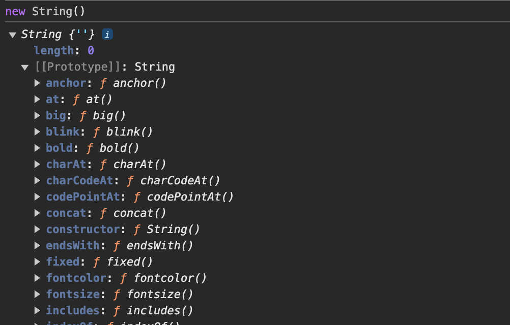

## Распространенные вопросы: Javascript:

### 1. Ссылочный тип

Как думаете, что будет если сделать данное сравнение -

Пример 1 :

```js
const a = 10;
const b = 10;

console.log(a === b);
```

Верно! Будет true. Все логично 10 === 10. А что тогда выведет данное сравнение -

Пример 2 :

```js
const person1 = { name: "Martin" };
const person2 = { name: "Martin" };

console.log(person1 === person2);
```

Тут неочевидно. Два одинаковых объекта, console.log вернет нам false. Почему так происходит? Нужно заглянуть как данные у объектов сравниваются и хранятся под копотом.

В случаи Примера 1.

```js
const a = 10; // 1010
const b = 10; // 1010
```

Каждая переменная хранится в байтах и когда мы сравниваем два значения, то у нас по сути проиcходит побайтовое сравнение этих величин.

В случаи с объектами, а это не только сам object, но и array, function, Maps, Set, WeakMaps, WeakSet и null **_(Все эти данные также являются объектом)_**.

Так как все типы данных === object мы можем изменять динамически, то и память для всех для этих данных является динамической. При создании объекта выделяется определенное пространство и выдается ссылка на этот объект.

```js
// Объекты - это ссылки на пространство, которое выделяется в памяти и сравнение идет по ссылке
const person1 = { name: "Martin" }; // 0x1913
const person2 = { name: "Martin" }; // 0x9212

console.log(person1 === person2); //  0x1913 === 0x9212
```

При этом если мы присваиваем одной переменной (которая являтся объектом) другой переменной, то мы просто выдаем ту же ссылку и вторая переменная будет являться первой:

Пример 3:

```js
const person1 = { name: "Martin", age: 20 }; // 0x12141
const person2 = person1; // 0x12141

console.log(person1 === person2); //Сравнение идет по ссылке 0x12141 === 0x12141

person1.surname = "Lubovski";

// Так как person1 и person2 являются одинаковой ссылкой и ведут на одно и то же пространство в памяти то -
console.log(person2.surname); // Lubovski
```

### 2. Контекст JS

Фундаментальная концепция в JS являющееся ключевым словом 'this'. Контекст просто ссылается на объект, к которому принадлежит текущий контекст выполнения. Код всегда выполняется внутри какого-то конекста.

Изначально есть глобальный объект контекста. У каждой среды выполнения он разный, у браузера - **_window_**. У NodeJS - **_global_**.

Можно убрать конекст через строгий режим 'use strict' - undefined.

Пример 4:

```js
function a() {
  console.log(this);
}

function b() {
  "use strict";
  console.log(this);
}

a(); // window
b(); // undefined
```

Рассмотрим такой пример. Пример 5:

```js
const user = {
  name: "Andrey",
  hello() {
    console.log("this", this); // {name: 'Andrey', hello()}
    return `Hello ${this.name}!`;
  },
  info: {
    age: 22,
    sex: "male",
    getSex() {
      console.log("this", this); // {age: 22, sex: 'male'...}
      return `Sex: ${this.sex}`;
    },
    getAge: () => {
      console.log("this", this); // window
      return `Age: ${this.age}`;
    },
  },
};

user.info.hello(); // Hello Andrey!
user.info.getSex(); // Sex: male
user.info.getAge(); // Age: undefined
```

Функция имеет свой контекст. В зависимости от места инициализации он разный. Функция hello() имеет конектс объекта user. Функция getSex() вложена в user.info и имеет двнный конекст. А вот функция getAge() является стрелочной.

**У стрелочных функций нету своего контекста**. Они связываются с ближайшим по иерархии контекстом, в котором они определены.

Как можно добавить новую функцию в user.info и связать контекст с user?

Пример 6:

```js
function getNameAgain() = {
    console.log('this', this) //
    return this.name
}

user.info.getNameAgain = getNameAgain // this - {age: 22, sex: 'male'...}
user.info.getNameAgain() // undefined

user.info.getNameAgain = user.info.getNameAgain.bind(user)
user.info.getNameAgain() // Andrey
```

При первом вызове функции getNameAgain() - контекс this будет user.info. Даллее с помощью функции bind - мы меняем контекст у функции устанавлвая user.

Есть три функции изменения контекста **_.bind(), .call(), .apply()_**. Данным функции принимают первым аргументом новый контекст, а следующим любые параметры передаваемые функции. Они все выполняют одно и то же (присваивают контекст), но различия .bind() и .call() - это то что .call() сразу еще и вызывает функцию. Функция .apply() также вызывает сразу функцию, но передача параметров у него передается через массив.

Функция .bind(). Пример 7:

```js
function getUserInfo(age) {
  return console.log(`Name ${this.name}. Age: ${age}`);
}

const user = { name: "Andrey" };
/* Вторым параметром передаем параметры функции. Функция сразу не вызывается */
getUserInfo = getUserInfo.bind(user, 22); // Name: Andrey. Age: 22
getUserInfo();
```

Функция .call(). Пример 8:

```js
function getUserInfo(age) {
  return console.log(`Name ${this.name}. Age: ${age}`);
}

const user = { name: "Andrey" };

/* Функция сразу вызывается с привязанным контекстом */
getUserInfo.call(user, 22); // Name: Andrey. Age: 22.
```

Функция .apply(). Пример 9:

```js
function getUserInfo(age) {
  return console.log(`Name ${this.name}. Age: ${age}`);
}

const user = { name: "Andrey" };

/* Функция сразу вызывается с привязанным контекстом. Параметры передаются через массив */
getUserInfo.apply(user, [22]); // Name: Andrey. Age: 22.
```

### 3. Что такое прототипы?

Прототипы - это механизм, который используется для организации наследования и повторного использования свойств и методов между объектами. В JavaScript объекты могут наследовать свойства и методы через прототипы, а не через классы, как это принято в классических объектно-ориентированных языках программирования.

К примеру у типа String есть набор функций.
Рисунок 1:



Можно задаться вопросом, чем они отличаются от классов из обычного ООП других языков?

- В прототипах объект можно изменять динамически, добавляя или изменяя свойства/методы на уровне экземпляров. В классах поведение объектов чаще задается на этапе создания через классы.
- В прототипах объекты наследуют от других объектов, тогда как в классовом ООП объекты создаются на основе классов.

Реализации прототипа через функции. Пример 11:

```js
function Animal(name, age) {
  this.name = name;
  this.age = age;
}

function Dog(name, age, parent) {
  this.__proto__ = new Animal(name, age);
  this.parent = parent;
}

const dog = new Dog("Busya", 2, "Andrey");

console.log("Dog name:", dog.name); // Busya
console.log("Dog age:", dog.age); // 2
console.log("Dog parent:", dog.parent); // Andrey
```

В данной реализации мы создаем не классы JS, а функции. Функция Animal является прототипов Dog. Наследование происходит через proto.

Реализации прототипа через class. Пример 12:

```js
class Animal {
  constructor(name, age) {
    this.name = name;
    this.age = age;
  }
}

class Dog extends Animal {
  constructor(name, age, parent) {
    super(name, age);
    this.parent = parent;
  }
}

const dog = new Dog("Busya", 2, "Andrey");

console.log("Dog name:", dog.name);
console.log("Dog age:", dog.age);
console.log("Dog parent:", dog.parent);
```

Классы в JS являются синтетическим сахаром над обычными прототипами.

### 3. Чем отличается proto от prototype?

**proto** - это внутреннее свойство любого объекта в JavaScript, которое указывает на его прототип, то есть на объект, от которого этот объект наследует свойства и методы.

**prototype** — это свойство функций-конструкторов (и только функций). Оно определяет объект-прототип, который будет использоваться для создания новых объектов с помощью оператора new.

Пример 13:

```js
function Animal() {}

Animal.prototype.speak = function () {
  console.log("Animal speaks");
};

const dog = new Animal();
dog.speak(); // Выведет: "Animal speaks"
```

Здесь Animal.prototype используется для добавления метода speak(), который будет доступен всем объектам, созданным через new Animal().

### 4. Разница между for in и for of?

for...in и for...of — это два разных цикла в JavaScript, которые используются для перебора коллекций, но они работают по-разному.

#### for...in

1. Используется для перебора свойств объекта.
2. Перебирает ключи (или имена свойств) объекта.
3. Подходит для объектов и массивов, но в случае массивов часто не рекомендуется, так как может перебрать и унаследованные свойства.

```js
const obj = { a: 1, b: 2, c: 3 };

for (let key in obj) {
  console.log(key, obj[key]); // выводит "a 1", "b 2", "c 3"
}
```

#### for...of

1. Используется для перебора значений в коллекциях, таких как массивы, строки, карты и наборы.
2. Перебирает элементы и подходит для массивов и других итерируемых объектов.

```js
const arr = [1, 2, 3];

for (let value of arr) {
  console.log(value); // выводит 1, 2, 3
}
```
